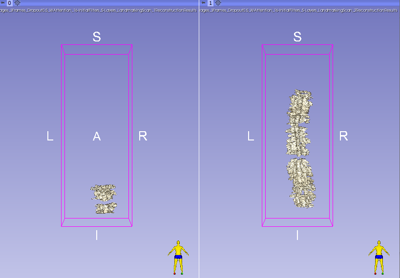

# SegmentationComparison

SegmentationComparison is a Slicer extension that displays volumes in a side-by-side comparison, and allows users to rate the volumes using a built-in survey section. It's intended purpose is to qualitatively compare neural networks, but it can be used for any volumes.

This version of the software was modified to compare AI reconstructions of the spine.

## Information

The following will describe the module and its basic functions.

**Inputs:**
This section sets the parameters for the comparison process. First, select the number of comparisons between randomy selected pairs of AI reconstructions that you wish to evaluate. Then, select the folder containing the set of models to be evaluated and click the Load button.

**Comparison:**
From top to bottom, this section contains:
1. A threshold slider for the currently displayed volumes.
2. A button to reset the camera to its original position. 
3. The survey itself, which supports ranking the AI reconstructions on the left and right sides of the screen on a scale of 1 to 5.
4. Buttons to navigate to the previous or next set of volumes, as well as a progress indicator.
5. A button to save the scene, which contains the final results.

**Settings:**
You can indicate here the directory where the csv file containing the results of the sruvey will be saved.

**3D View:**
After loading the input folder, the 3D view should display a pair of volumes. By default, the camera will be centered on a posterior view of the volume. The name of the volume is shown on the top right corner and an orientation marker is shown in the bottom right corner.

The user can drag the 3D view with left click, and can zoom in or out with the scroll wheel. 

